<h1 align="center">JavaScript Fundamentals 📗</h1>
<h2 align="center"> Types, Variables and Functions</h2>
<h3>Hello! This is my study repository of Javascript programming, if you want to study too, you're welcome! :)</h3>

## Type Number
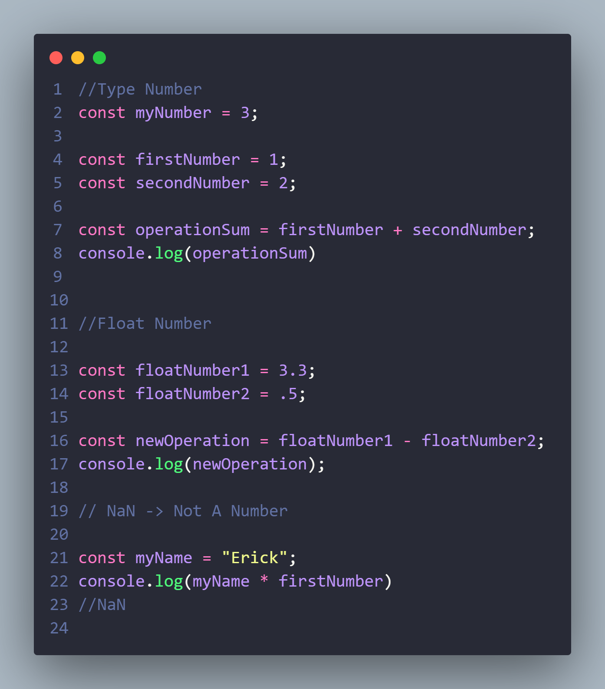

## Type String
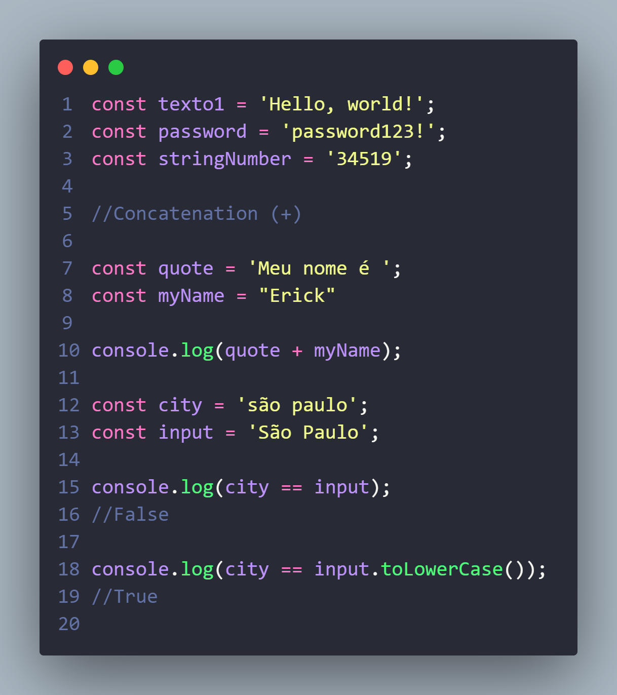

## Type Boolean
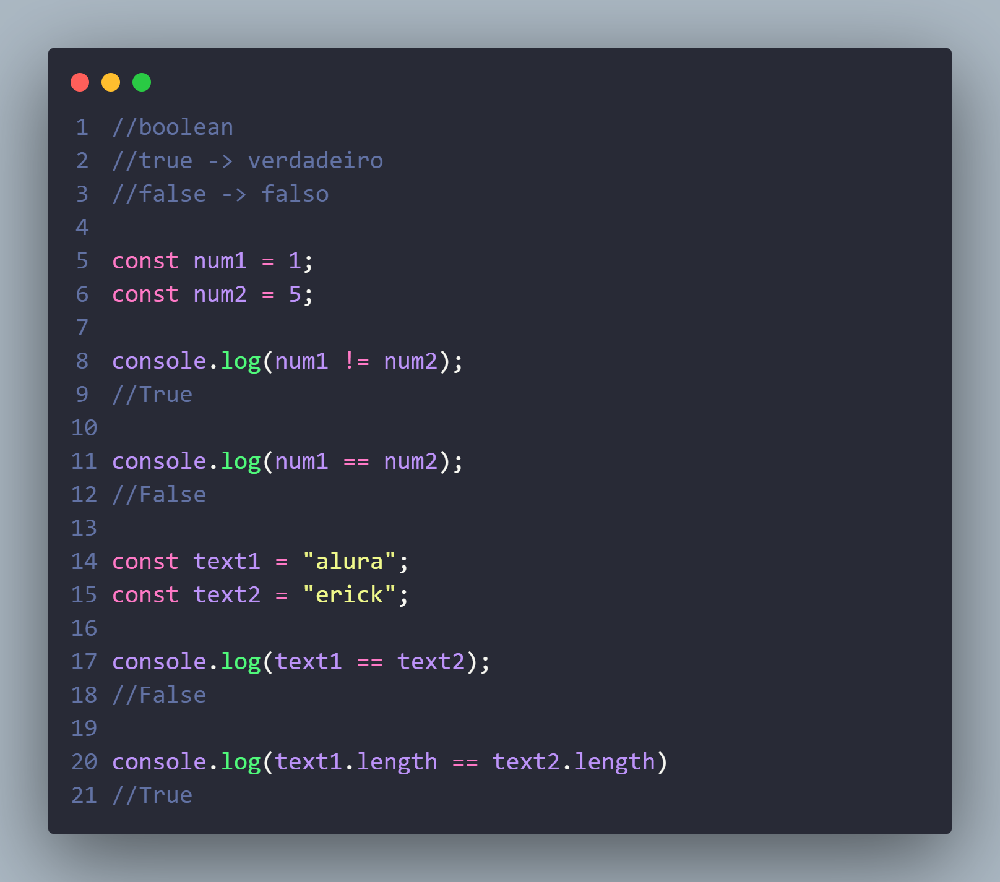

## Conversions
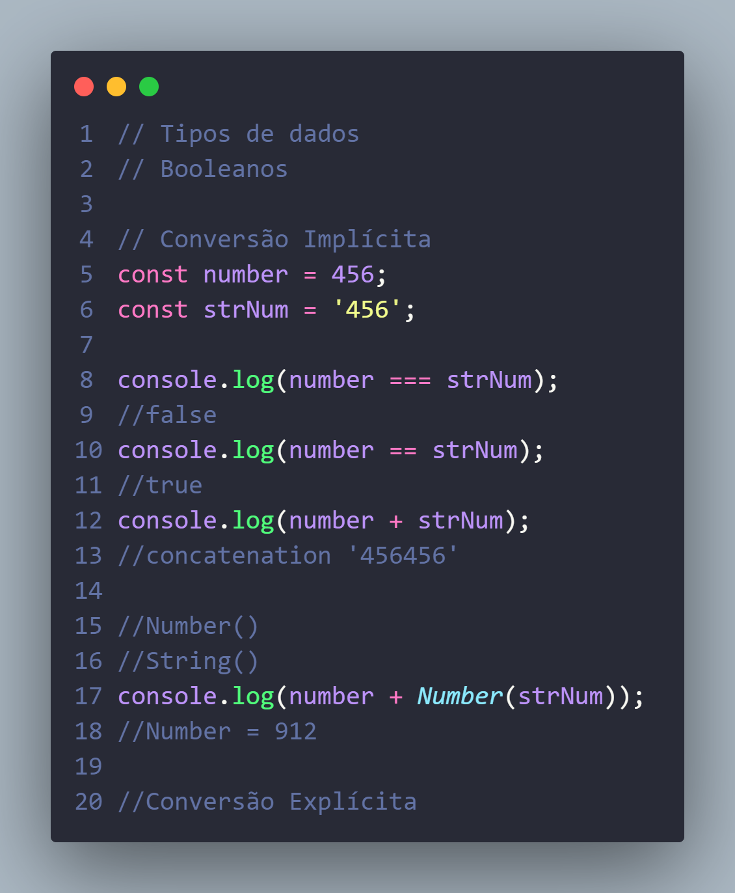

## Comparations
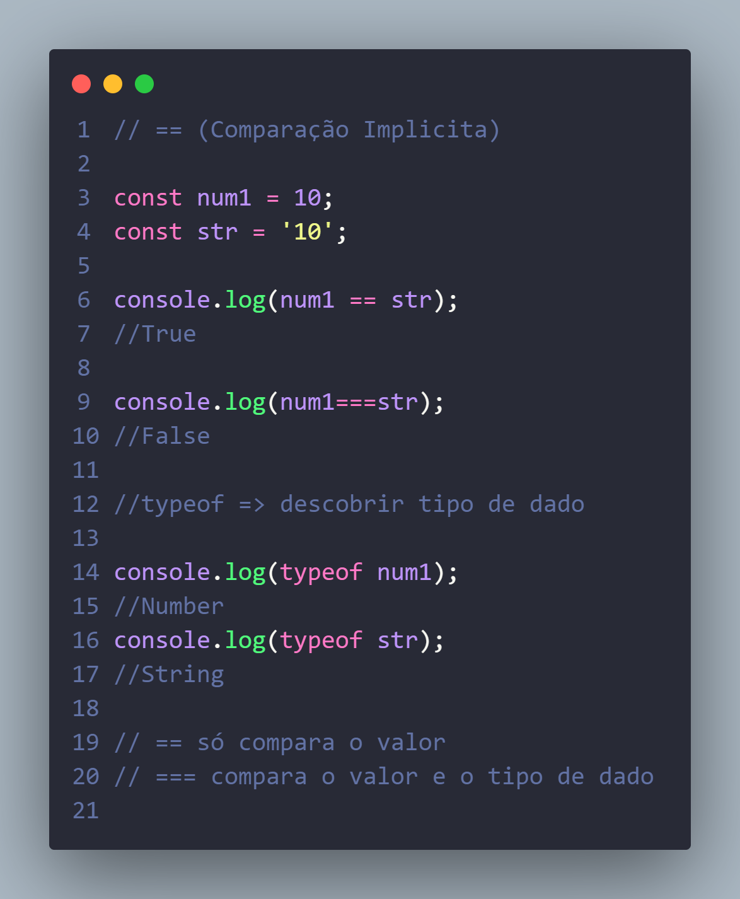

## Truthy or Falsy
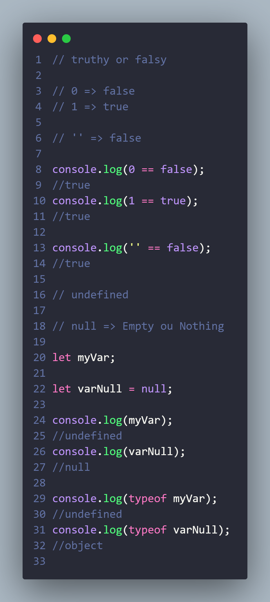

## Functions
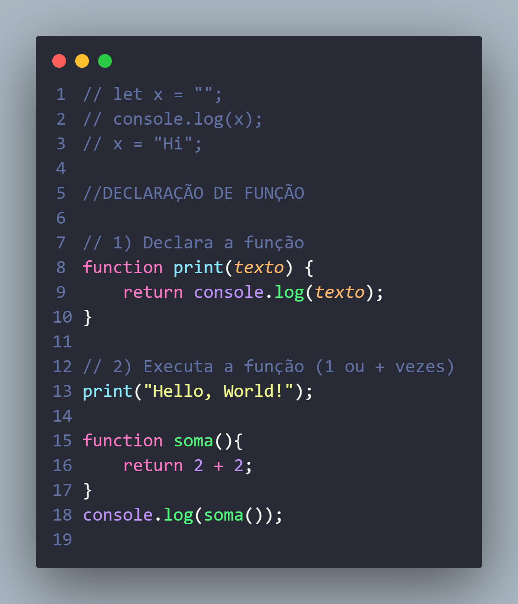

## Parameters
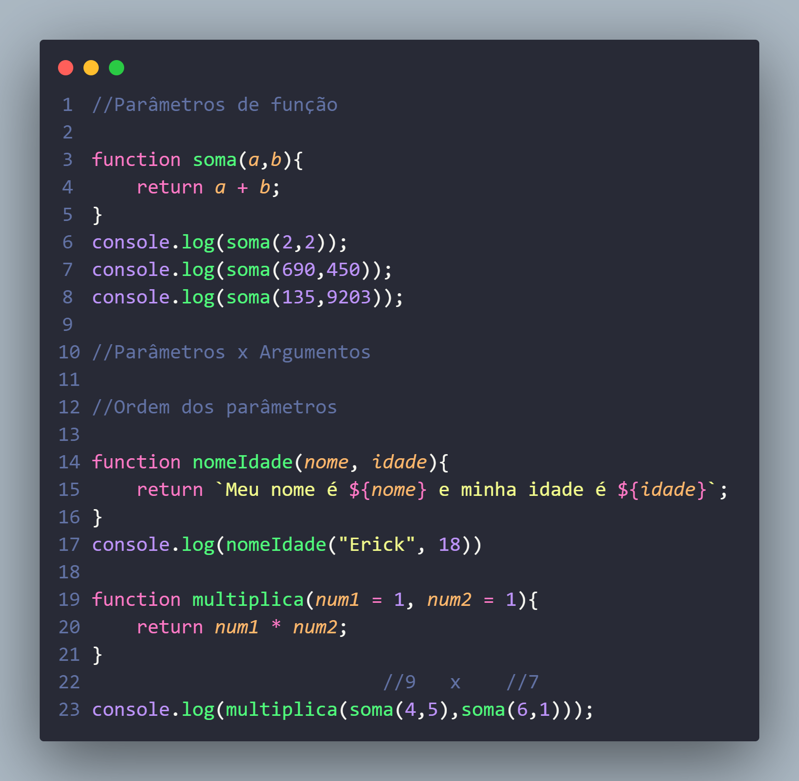

## Expressions
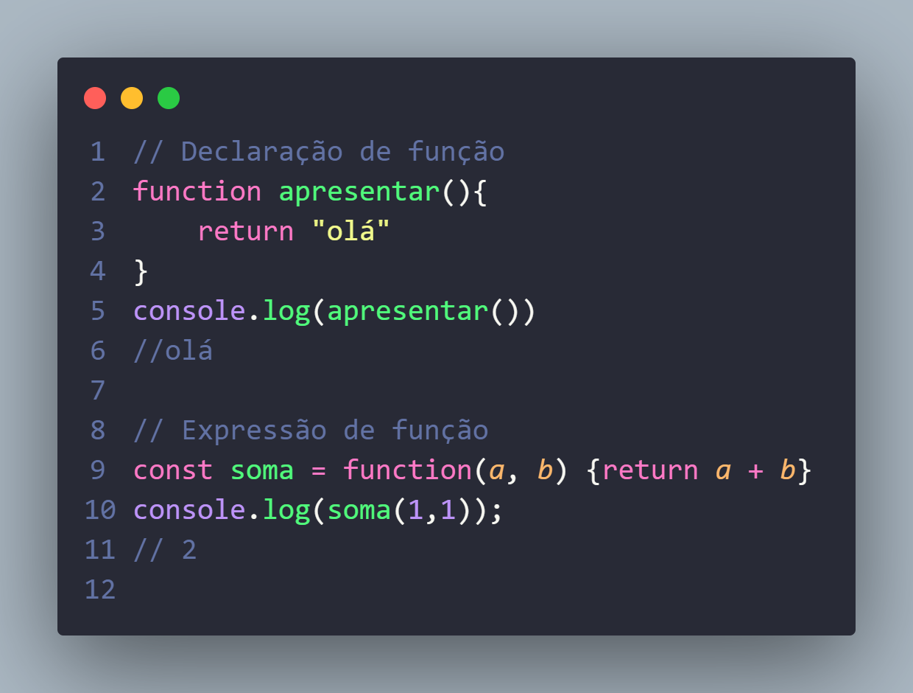

## Template String
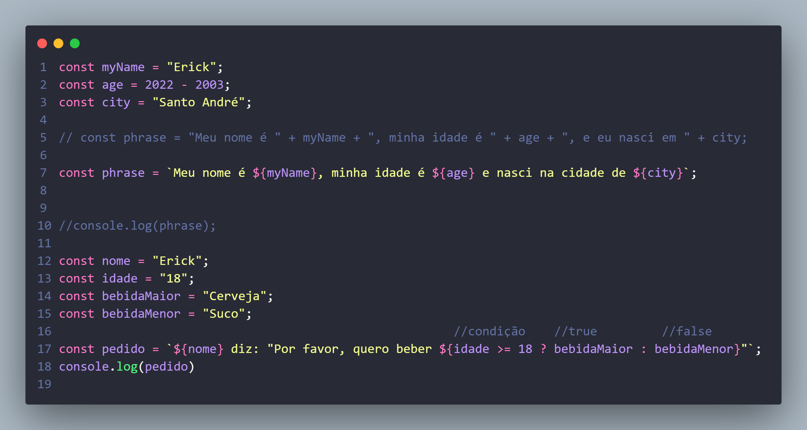

## Ternary
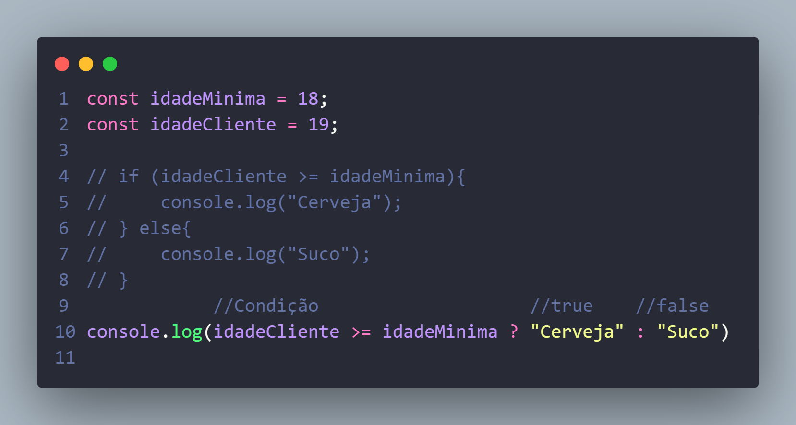

## Arrow Function
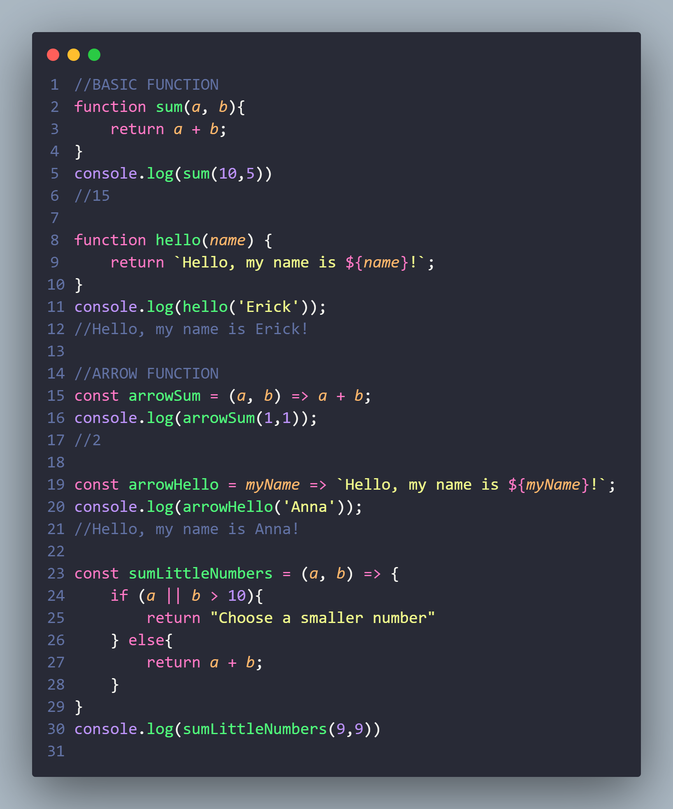

<h1>Thank You! ;)</h1>
